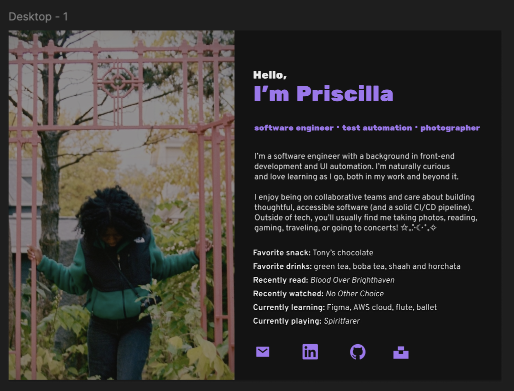
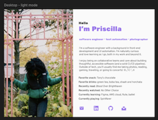
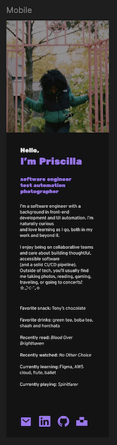

# 🌐 Personal Portfolio Website 

This is my personal developer portfolio site. The goal was to keep the tech stack simple and focus on strong fundamentals, layout structure, responsiveness, and visual clarity. Also, my main intention was to finish it. I've been meaning to create a portfolio site for years and never prioritized it. 😅

---

## ✨ About This Project
- **Design:** Created in Figma (I learned how to design in Figma)
- **Built With:** HTML, CSS, and Tailwind CSS
- **Deployed On:** TBD

---

## 🎨 Design Process

I designed the layout and visual system in Figma before writing any code. My previous experience with Figma was using dev mode to translate design files to code so this was my first foray in using Figma as a designer. I used this short Youtube video as a tutorial: https://www.youtube.com/watch?v=jQ1sfKIl50E

### 🖼 Figma Screenshots

#### Desktop Design

#### Mobile Design

*(Note: These screenshots reflect my early design iterations as I was learning Figma. The final implementation may vary slightly as I refined spacing and responsiveness during development.)*

---

## 🛠 Tech Stack

- HTML5  
- CSS3  
- Tailwind CSS  

No JavaScript frameworks were used. This project focuses on layout, structure, and styling fundamentals.

---

## 📚 What I Focused On

- Finishing.
- Responsive layout
- Clean visual hierarchy
- Simple first, to be expanded later
- Semantic HTML structure
- Translating design → code accurately

---

## 🚀 Future Improvements

- Improve accessibility (ARIA roles, focus states, color contrast)
- Add a light mode/dark mode toggle for fun-sies
- Add projects created with React and Next.js (photography portfolio first!)
 
---
Built with intention and curiosity 💜
